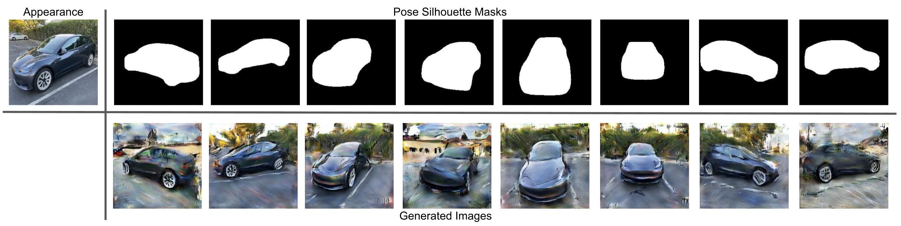

# PoseGen: Pose-Conditioned Image Generation

We present a flexible approach for conditional generation of objects given any combination of three desired input types: object (e.g. car), pose, and background. This approach can help us generate realistic training data in a controllable way and at large scale.



### [Paper](paper/pose-conditioned image generation.pdf)

### Getting Started

* Install [Miniconda](https://docs.conda.io/en/latest/miniconda.html)
* Create and activate conda environment.

```shell
conda env create -f conda_env.yml
conda activate posegen
```

> NOTE: PyTorch dependency specified in `environment/conda_env.yml` uses CUDA 11.1. If CUDA 11.1 is unsupported on your environment, please install PyTorch separately by following the [official instructions](https://pytorch.org).

### Datasets
* Download datasets.
```shell
sh misc/download-data.sh
```

This script will download data into `/data/`.

### Experiments
Run:
```shell
python experiment.py
```

- Experiments we conducted are listed in `posegen/experiments/cars.py`. 
- Common configs between experiments are in `posegen/experiments/common.py`
- Experiment results are logged and also written to W&B (see `posegen/config.py`)
