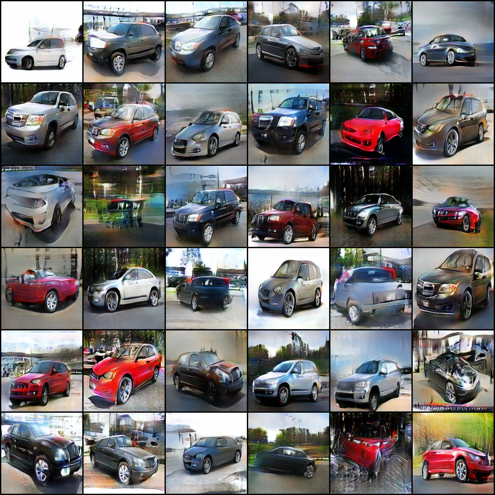

# PoseGen: Self-Supervised Pose-Conditioned Image Generation

## Getting Started

* Install [Miniconda](https://docs.conda.io/en/latest/miniconda.html) package manager.
* Create and activate conda environment.

```shell
conda env create -f conda_env.yml
conda activate posegen
```

> NOTE: PyTorch dependency specified in `environment/conda_env.yml` uses CUDA 11.1. If CUDA 11.1 is unsupported on your environment, please install PyTorch separately by following the [official instructions](https://pytorch.org).

* Download Stanford Cars dataset.

```shell
cd data_dir
sh {PoseGen DIR}/src/misc/stanford_cars_dataset_downloader.sh
```

* Start training using baseline model.

```shell
python train.py --name EXPERMENT_NAME
```

* Evaluate trained models.

```shell
python eval.py --ckpt_path PATH_TO_CKPT --im_size RESOLUTION
```

* Visualize baseline logs and your experiments using Tensorboard.

```shell
tensorboard --logdir out --bind_all
```

> NOTE: Metrics logged during training (e.g. IS, FID, KID) are approximations computed using limited data. Use `eval.py` to compute accurate metrics.

# Evaluation  

## Initial Auto-Encoder model (11/10/2021)

Models                    |GAN (default)              |
:------------------------:|:-------------------------:|
Resolution                |256x256                    |
Seed                      |0                          |
Batch Size                |32                         |
n<sub>iter</sub>          |150k                       |
n<sub>dis</sub>           |5                          |
β<sub>1</sub>             |0                          |
β<sub>2</sub>             |0.9                        |
lr                        |2e-4                       |
lr<sub>decay</sub>        |Linear                     |
len(z)                    |1024                       |
IS                        |2.755932                   |
FID                       |57.62947                   |
KID                       |0.038041                   |
Samples                   | Real / Fake               |   
Samples                   | <p float="left"> </p> |  

## Initial GAN model (11/08/2021)

Models                    |GAN (default)              |
:------------------------:|:-------------------------:|
Resolution                |256x256                    |
Seed                      |0                          |
Batch Size                |32                         |
n<sub>iter</sub>          |150k                       |
n<sub>dis</sub>           |5                          |
β<sub>1</sub>             |0                          |
β<sub>2</sub>             |0.9                        |
lr                        |2e-4                       |
lr<sub>decay</sub>        |Linear                     |
len(z)                    |128                        |
IS                        |2.182418                   |
FID                       |50.09494                   |
KID                       |0.033805                   |
Samples                   |     |   
